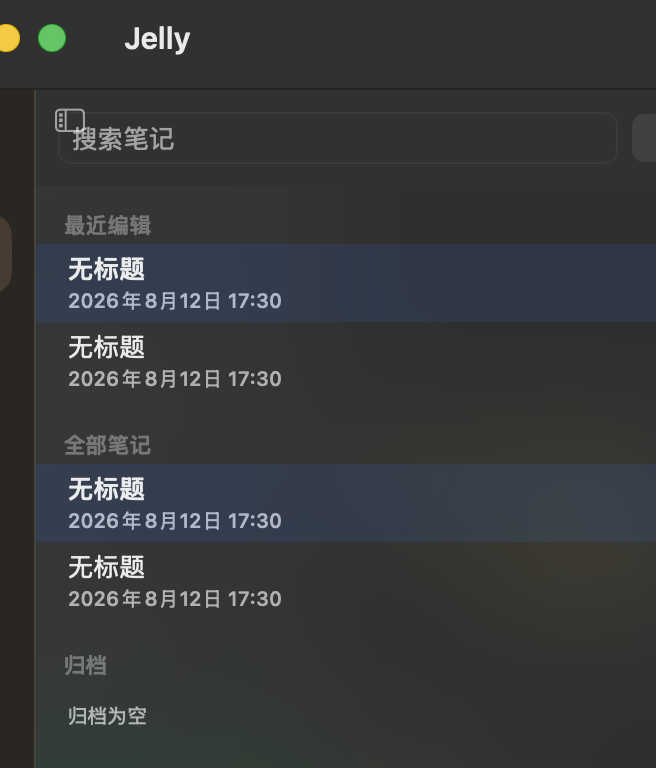
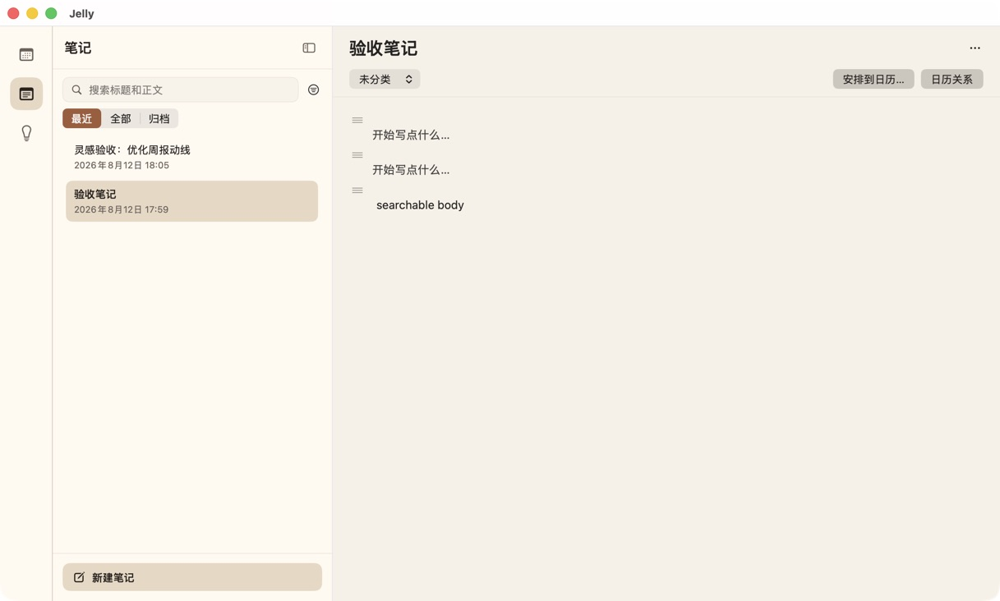
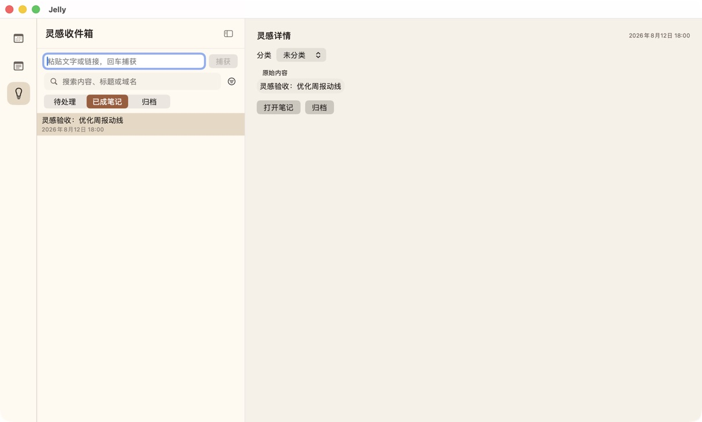

# 笔记与灵感设计复验 — 2026-08-12

## 复验结论

修复前的界面不能验收：笔记页左上图标压住搜索框，新建后看不到明确正文入口，同一篇笔记重复出现在“最近编辑”和“全部笔记”，右上角还混入了灵感的分类管理。修复后，笔记和灵感的主要任务都形成了从入口到结果、再回到列表的完整动线。

## 发现与处理

| 问题 | 用户影响 | 处理 |
|---|---|---|
| 浮动列表图标覆盖搜索框 | 第一眼就像界面坏了 | 移除悬浮覆盖，列表与编辑器各自使用固定头部 |
| 新建后正文入口不可辨认 | 用户不知道去哪里写 | 新建后进入编辑，空正文显示“开始写点什么…” |
| 最近与全部同时展开 | 同一内容重复，难理解选中状态 | 改成最近 / 全部 / 归档互斥范围 |
| 灵感 `.toolbar` 泄漏到其他模块 | 笔记页出现用途不明的“分类” | 分类筛选和管理收回灵感浏览区内部 |
| 大块系统蓝灰选中态 | 与日历的暖色视觉断裂 | 统一使用日历语义主题和暖色选中态 |
| 转换后的灵感仍显示“转为笔记” | 容易误以为会再次创建 | 已转换状态显示“打开笔记” |
| 灵感列表文字可见但行不稳定可点 | 真实使用时点了没反应 | 增加整行点击区域、标签和选中状态 |
| 元数据状态显示英文内部值 | 面向用户的完成度不足 | 改成正在获取 / 已获取 / 获取失败 |

## 修复后的主任务动线

笔记：`新建笔记 → 输入标题/正文 → 搜索 → 重启仍在 → 安排到日历 → 打开准确日历事项`

灵感：`捕获文本或 URL → 搜索/查看详情 → 转为笔记或归档 → 打开准确笔记或恢复`

## 截图

### 修复前

### 修复后：笔记

### 修复后：灵感

## 证据边界

- 上述修复后截图来自最终 `0.2.1 (3)` ZIP 解压应用，不是 SwiftUI Preview。
- 本轮真实点击覆盖创建、正文输入、搜索、重启、日历关系、灵感捕获、转换、归档、恢复、复制链接和元数据失败重试。
- 笔记归档和恢复已在最终包真实点击；永久删除最终确认、VoiceOver 连续朗读和中文输入法组合态没有被写成已验收。
